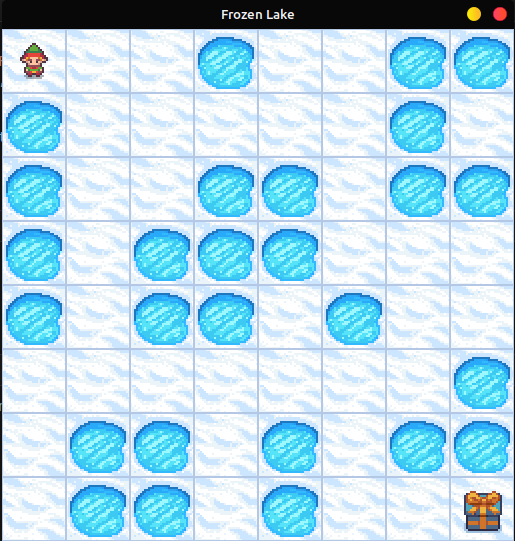

# FrozenLake-Navigation-Using-RL

This repository contains the second part of the third assignment for the course ```CS 451 - Computational Intelligence```. The assignment is to build an RL Based Agent to navigate the Frozen Lake Environment available on OpenAI gym which involves the agent going from Start(S) to Goal(G) without falling into any Holes(H) by walking over the Frozen(F) lake.

The agent is moving around (via Up, Down, Left, Right actions) to accumulate the reward that is received when a goal state is reached. The presence of holes in the grid restricts the movement of the agent. We had to determine a policy via value iteration to guide the agent in navigating the grid. 

Three different configurations for the frozen lake have been given, and our agent performs well in all the cases. 

Frozen Lake Environment along with the Agent:
